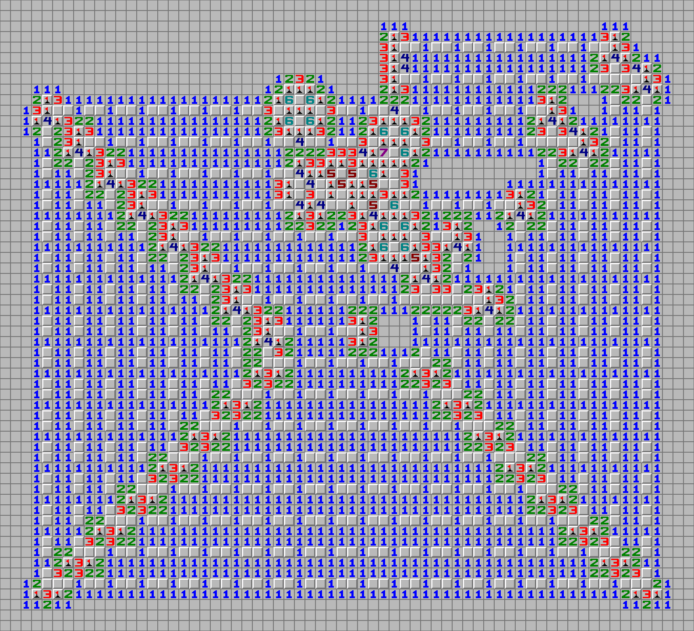

<!--suppress HtmlDeprecatedAttribute -->
<h1 align="center">PyRTLSweeper</h1>

<p align="center">
    <a href="/LICENSE">
        
    </a>
</p>

**Listen to the talk: [PyRTLSweeper: Automated Transformation of Digital Circuits to Minesweeper Boards](https://youtu.be/34RXtKhsOSs)**

**Also check out [the paper](https://edwinchang.dev/pyrtlsweeper/paper.pdf) and [the poster](https://edwinchang.dev/pyrtlsweeper/poster.pdf).**

PyRTLSweeper is a Python package that takes a stateless circuit written with [PyRTL](https://ucsbarchlab.github.io/PyRTL/) and produces a Minesweeper board readable by [JSMinesweeper](https://davidnhill.github.io/JSMinesweeper/) that represents the circuit. The player can designate input cells to be flagged or not flagged, and some output cells are determined to have a mine or not.

## Example

The following circuit:

```python
a = pyrtl.Input(bitwidth=1, name="a")
b = pyrtl.Input(bitwidth=1, name="b")
c = pyrtl.Output(bitwidth=1, name="c")

# OR gate
c <<= a | b
```

produces this Minesweeper board:



The inputs are the two wires at the top center, and the output is the wires at the center.

There is another example circuit in [`examples/circuit.py`](./examples/circuit.py) which you can test for yourself.

## Try it out

To get started with PyRTLSweeper, try editing and running [the example](./examples/circuit.py) with [uv](https://docs.astral.sh/uv/):

```bash
uv run ./examples/circuit.py
```

This will create a file called `circuit.mine`.

Now open [JSMinesweeper](https://davidnhill.github.io/JSMinesweeper/), click `Switch to Analyzer` at the top left, and drag `circuit.mine` into the window. Then give it a couple seconds and you should see the Minesweeper board representing the circuit.

The two wires at the top center are the inputs. Right click to place flags on them, and click `Analyse` to see the outputs in the two wires at the center. A flag on the left side of a hidden cell pair is `0`, and a flag on the right side is `1`.

Try editing the example and re-running it to see what happens! Just don't make it too big or your browser will not like you.

> [!NOTE] PyRTLSweeper currently does not support registers and memories due to the complexity of state preservation.

## License

[MIT](./LICENSE)
